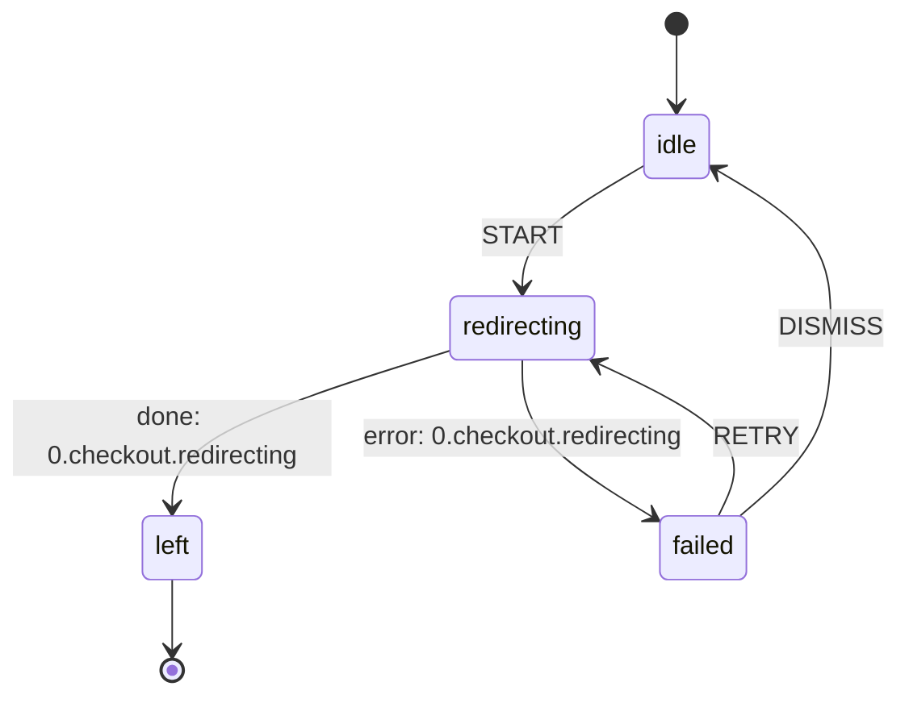

# checkout

Source: `src/blocks/billing/ui/checkout.machine.ts`

```mermaid
stateDiagram-v2
  [*] --> idle
  idle --> redirecting : START
  redirecting --> left : done: 0.checkout.redirecting
  redirecting --> failed : error: 0.checkout.redirecting
  failed --> redirecting : RETRY
  failed --> idle : DISMISS
  left --> [*]
```
