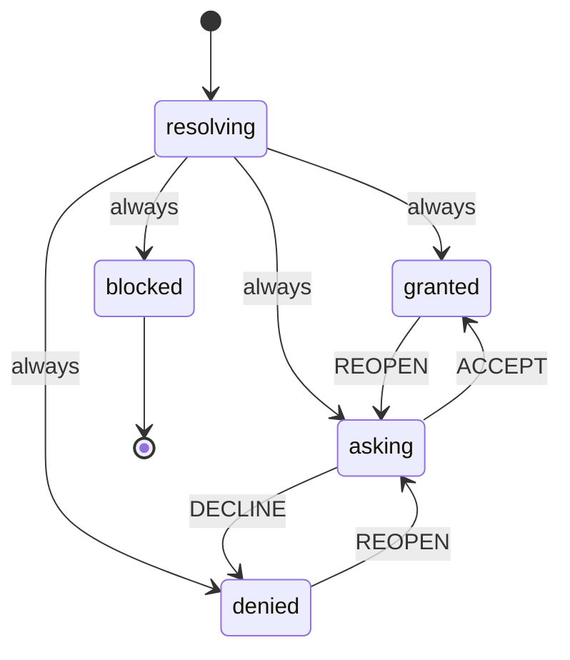

# consent

Source: `src/core/consent/ui/consent.machine.ts`

```mermaid
stateDiagram-v2
  [*] --> resolving
  resolving --> blocked : always
  resolving --> granted : always
  resolving --> denied : always
  resolving --> asking : always
  asking --> granted : ACCEPT
  asking --> denied : DECLINE
  granted --> asking : REOPEN
  denied --> asking : REOPEN
  blocked --> [*]
```
