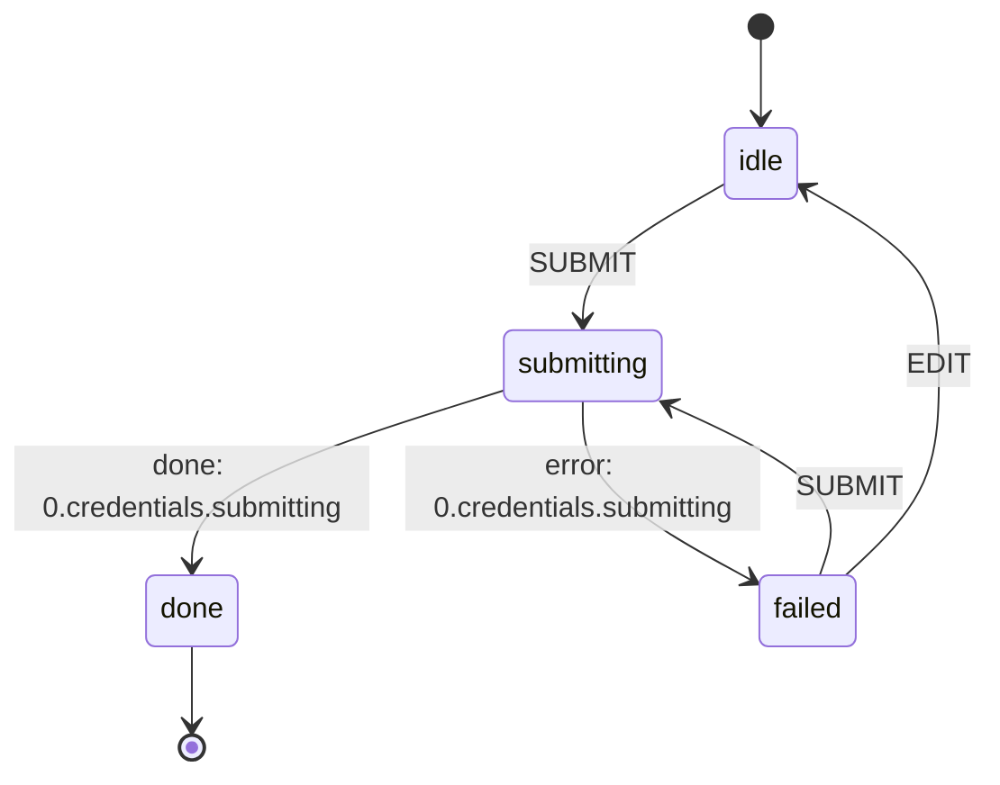

# credentials

Source: `src/blocks/auth/ui/credentials.machine.ts`

```mermaid
stateDiagram-v2
  [*] --> idle
  idle --> submitting : SUBMIT
  submitting --> done : done: 0.credentials.submitting
  submitting --> failed : error: 0.credentials.submitting
  failed --> submitting : SUBMIT
  failed --> idle : EDIT
  done --> [*]
```
