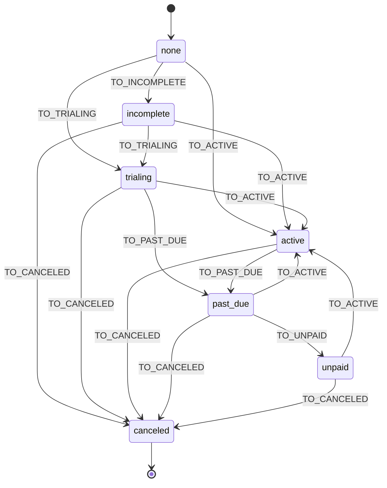

# subscription

Source: `src/blocks/billing/subscription.machine.ts`

```mermaid
stateDiagram-v2
  [*] --> none
  none --> incomplete : TO_INCOMPLETE
  none --> trialing : TO_TRIALING
  none --> active : TO_ACTIVE
  incomplete --> active : TO_ACTIVE
  incomplete --> trialing : TO_TRIALING
  incomplete --> canceled : TO_CANCELED
  trialing --> active : TO_ACTIVE
  trialing --> past_due : TO_PAST_DUE
  trialing --> canceled : TO_CANCELED
  active --> past_due : TO_PAST_DUE
  active --> canceled : TO_CANCELED
  past_due --> active : TO_ACTIVE
  past_due --> unpaid : TO_UNPAID
  past_due --> canceled : TO_CANCELED
  unpaid --> active : TO_ACTIVE
  unpaid --> canceled : TO_CANCELED
  canceled --> [*]
```
