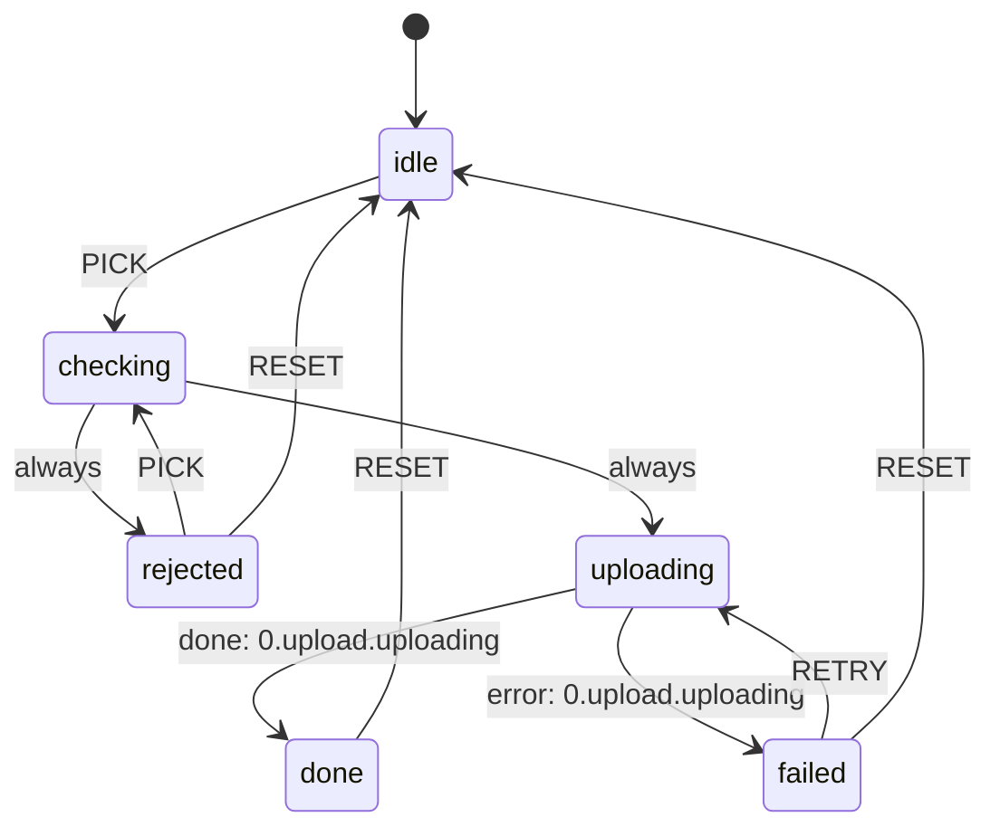

# upload

Source: `src/blocks/r2/ui/upload.machine.ts`

```mermaid
stateDiagram-v2
  [*] --> idle
  idle --> checking : PICK
  checking --> rejected : always
  checking --> uploading : always
  uploading --> done : done: 0.upload.uploading
  uploading --> failed : error: 0.upload.uploading
  rejected --> checking : PICK
  rejected --> idle : RESET
  failed --> uploading : RETRY
  failed --> idle : RESET
  done --> idle : RESET
```
